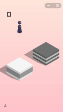
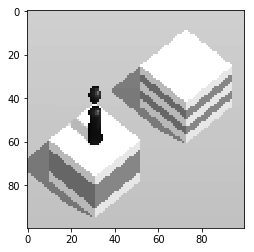
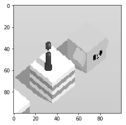

# Wechat Jump Game Reinforcement Learning

This is a reinforcement learning implement on Wechat Jump Game. 

## Goal

The purpose is not for solving this specific game. Actually, Q learning may not be the most efficient way for this game. It is just my experiment of letting the computer to learn a game from images directly, without "rule teaching". If you only want to solve this game, there are some pixel analysis which can give much more accurate results. 

## The game

 

The Wechat Jump game is a game in the Wechat Android app, by Tencent company. In this game, you need to control the chess piece to jump from one object the the next. The time period of pressing the screen will decide the distance the piece will jump. 

The data I used to feed the model include *current states (pixels), actions, next states(pixels)*, and *rewards*. One example is as following:

 -- Take action 6 (one of the discretized actions) -->  --> Reward=1 (the change of the score of the game)

(see Memory_checker.ipynb for more examples).

## Model structure

I used a CNN for training. See the model structure below.

The input is the pixel matrix of the useful area, and the output is the Q function value for different actions. The action is the duration length of the press (which is used to control the jump distance in the game). The press time is between 300-1200 ms, and is discretized into 15 intervals.

The input data is produced from my Android phone with ADB tools. A memory list is used for playback, and each time a batch is fed to the model. 

The data collecting is way too slow, because one jump takes around a second, and the delay of ADB screen-shot is remarkable. So a pixel masking tool is used to generate different rewards to actions for each picture. In theory, it is similar to the data produced by more steps without that additional generation. But it is still very slow.

<pre>
_________________________________________________________________
Layer (type)                 Output Shape              Param #   
=================================================================
conv2d_1 (Conv2D)            (None, 96, 96, 8)         208       
_________________________________________________________________
max_pooling2d_1 (MaxPooling2 (None, 24, 24, 8)         0         
_________________________________________________________________
conv2d_2 (Conv2D)            (None, 22, 22, 16)        1168      
_________________________________________________________________
max_pooling2d_2 (MaxPooling2 (None, 5, 5, 16)          0         
_________________________________________________________________
flatten_1 (Flatten)          (None, 400)               0         
_________________________________________________________________
dense_1 (Dense)              (None, 32)                12832     
_________________________________________________________________
dropout_1 (Dropout)          (None, 32)                0         
_________________________________________________________________
dense_2 (Dense)              (None, 15)                495       
=================================================================
Total params: 14,703
_________________________________________________________________
</pre>

## Result

See Memory_checker.ipynb

After training 2 nights, only ~10000 steps, the "die rate" is 0.039 in the last memory list. The best score is only 175 (I cannot achieve this score by hands, but many of my friends can). With more training, the model is expected to do better. (But I won't do that, since I want to keep my cell phone's life span...)

